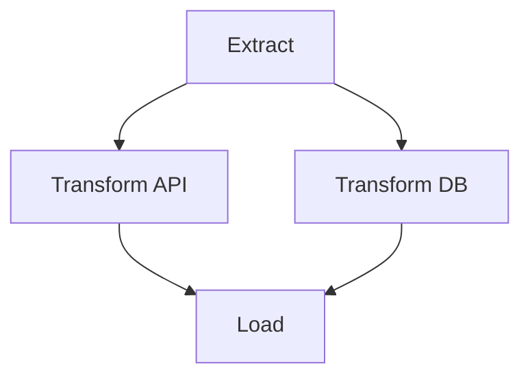
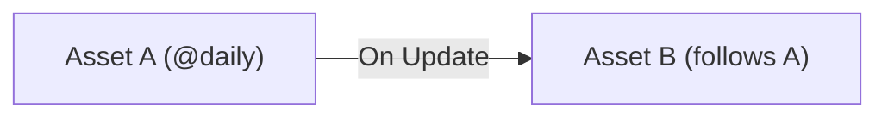

# Airflow 3 Reference

Technical notes and code samples for Airflow 3 features using `airflow.sdk` and the Asset model (AIP-60).

---

## 🛠️ Task SDK Basics

Airflow 3 simplifies workflow definition using pure Python decorators.

```python
from airflow.sdk import dag, task

@dag(dag_id="example_basics")
def example_basics():
    @task.python
    def extract():
        return {"data": [1, 2, 3]}

    @task.python
    def process(input_data):
        return [x * 2 for x in input_data["data"]]

    process(extract())

example_basics()
```

### Automatic XComs
Returning values from a `@task` and passing them as arguments to another task automatically handles XCom orchestration.

---

## 🚦 Workflow Control

### Parallel Execution (Fan-out/Fan-in)


### Conditional Branching
Using `@task.branch` for runtime logic.

```python
@task.branch
def decider(condition):
    if condition:
        return "task_a"
    return "task_b"
```

---

## 📅 Scheduling & Time

### Incremental Loads
Use `data_interval_start` and `data_interval_end` context variables for contiguous, idempotent data windows.

```python
@task.python
def fetch(**kwargs):
    start = kwargs['data_interval_start']
    end = kwargs['data_interval_end']
    # Logic based on time window
```

### Timetables
- **Cron Expressions**: `schedule="0 0 * * *"`
- **Delta Intervals**: `DeltaDataIntervalTimetable(duration(days=3))`

---

## 📦 Assets (AIP-60)

A declarative approach focusing on data state rather than task timers.

### Definition
Assets are self-registering and don't require explicit calls.

```python
@asset(schedule="@daily", name="my_data")
def update_data(self):
    ...
```

### Data-Aware Dependencies
Assets trigger automatically when their linked dependencies are updated.



```python
@asset(schedule=asset_a) # Triggers on asset_a update
def update_b(self):
    ...
```

---

## 📋 Core Principles
1. **Idempotency**: Runs should be repeatable with the same output for a given time window.
2. **Declarative**: Use Assets to decouple data production from consumption.
3. **SDK First**: Leverage `airflow.sdk` for modern Python developer experience.
