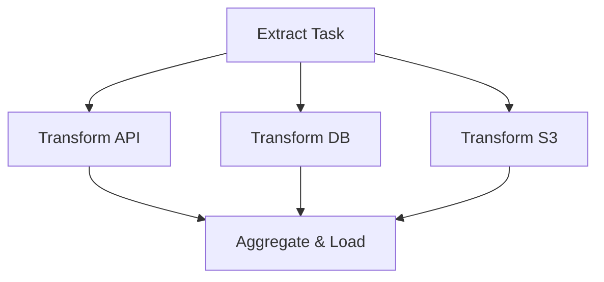

# Apache Airflow 3: The Complete Guide (2026)

This repository contains the source code for the **Apache Airflow 3 Full Course**. It demonstrates the transition from traditional task-based orchestration to modern, **Data-Centric Orchestration** using the Airflow 3 Task SDK.

---

## 🏗️ Evolution of Airflow

The essence of this tutorial is the shift from complex, boilerplate-heavy code to a clean, Pythonic developer experience.

### 1. The Foundation: Task SDK
Airflow 3 introduces the `airflow.sdk`, allowing you to define workflows using simple Python decorators.

```python
from airflow.sdk import dag, task

@dag(dag_id="tutorial_basics")
def tutorial_basics():
    @task.python
    def extract():
        return {"data": [10, 20, 30]}

    @task.python
    def process(input_data):
        return [x * 2 for x in input_data["data"]]

    # Seamless data passing (Automatic XComs)
    process(extract())

tutorial_basics()
```

### 2. Advanced Workflow Patterns
The tutorial covers how to handle complex dependencies, including **Parallelism (Fan-out/Fan-in)** and **Conditional Branching**.

#### Parallel Execution Flow


#### Branching Logic
Using the `@task.branch` decorator to skip tasks based on runtime conditions (e.g., Weekend vs. Weekday).

```python
@task.branch
def decider(weekend_flag):
    return "no_load_task" if weekend_flag == "true" else "load_data"
```

### 3. Mastering the Timeline
The course explains how Airflow handles time through the Scheduler. It moves beyond simple Cron expressions to **Delta Timetables** and **Incremental Loads**.

- **Incremental Load Essence**: Using `data_interval_start` and `data_interval_end` to ensure **Idempotency**.
- **Contiguous Windows**: Ensuring no data is lost or duplicated between consecutive runs.

---

## 💎 The New Era: Declarative Assets (AIP-60)

The "Final Boss" of the tutorial is the **Asset Model**. Instead of scheduling a "DAG," you define a "Data Asset" that self-updates.

### Why Assets?
- **Self-Registering**: No need to explicitly call the DAG.
- **Event-Driven**: Tasks trigger automatically when their dependent data is updated.

```python
@asset(schedule="@daily", name="source_data")
def fetch_data(self):
    # Writes data to a physical location
    ...

@asset(schedule=source_data) # Triggers ONLY when source_data is ready
def process_data(self):
    # Logic to process the above asset
    ...
```

### Data-Aware Dependency Flow
```mermaid
graph LR
    Source[(@daily) Source Asset] -- "Update Event" --> Dependent[(Dependent Asset)]
    Dependent -- "Downstream Signal" --> Analytics[BI / Analytics Tool]
```

---

## 🚀 Key Takeaways from the Tutorial
1. **Developer Experience**: Write pure Python; let `airflow.sdk` handle the orchestration.
2. **Data Integrity**: Use `data_interval` variables for precise, retry-safe incremental loads.
3. **Future-Proofing**: Move towards **Assets** for a decoupled, scalable data architecture.
